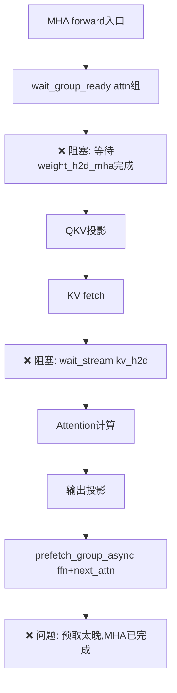
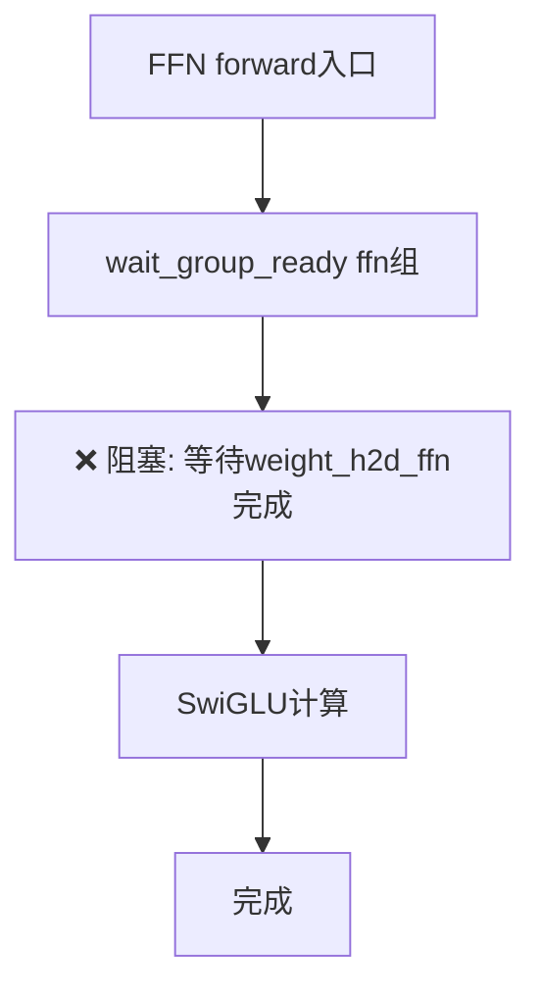

# Llama3 70B 多流并行重叠完整审计与解决方案

## 执行概要 (Executive Summary)

**硬件环境**: 16GB GPU HBM + 128GB DRAM
**模型**: Llama3-1-70B (80层, ~140GB参数)
**当前问题**: 尽管系统已实现6条CUDA流的复杂架构,但仍未达到计算与IO的完美重叠,GPU经常等待数据加载

**根本原因**: 7个关键同步点导致并行流水线被阻塞,包括:
1. ❌ 显式的 `wait_stream()` 调用阻塞主流
2. ❌ 同步式的权重组加载 (`ensure_group_on_gpu`)
3. ❌ KV Cache H2D在compute流上的强制等待
4. ❌ 层间串行执行模式 (每层MHA→FFN→下一层)
5. ❌ 缺少真正的双缓冲/预取流水
6. ❌ 事件同步粒度过粗
7. ❌ 全局同步点 (`torch.cuda.synchronize()`)

---

## 1. 当前架构分析

### 1.1 多流架构 (6 Streams)

您的系统已实现6条CUDA流 ([stream_mnt.py:107-220](stream_mnt.py#L107-L220)):

```python
class Streams:
    compute_mha: Optional[torch.cuda.Stream]       # 优先级=-1 (高)
    compute_ffn: Optional[torch.cuda.Stream]       # 优先级=0 (普通)
    weight_h2d_mha: Optional[torch.cuda.Stream]    # 优先级=-1 (高)
    weight_h2d_ffn: Optional[torch.cuda.Stream]    # 优先级=0 (普通)
    kv_h2d: Optional[torch.cuda.Stream]            # 优先级=-1 (高)
    kv_d2h: Optional[torch.cuda.Stream]            # 优先级=0 (普通)
```

**优先级分配合理性**: ✅ MHA计算和权重/KV加载使用高优先级,FFN使用普通优先级

### 1.2 权重流式管理 (WSM - Weight Streaming Manager)

**关键发现** ([weight_streaming_manager.py:92-500](weight_streaming_manager.py#L92-L500)):

1. **组级调度器** (Group-level Scheduler):
   - 将每层分解为 `attn` 和 `ffn` 两个组
   - 使用 `gpu_max_groups=8` 控制GPU驻留上限
   - **问题**: 平衡调度器 `rebalance_and_topoff()` 是同步的

2. **预取机制** ([weight_streaming_manager.py:2551-2650](weight_streaming_manager.py#L2551-L2650)):
   ```python
   def prefetch_group_async(self, layer_idx, kind, pin=False):
       # ✅ 异步预取到GPU
       # ❌ 但缺少与下游计算的真正流水
   ```

3. **等待屏障** ([weight_streaming_manager.py:2277-2390](weight_streaming_manager.py#L2277-L2390)):
   ```python
   def wait_group_ready(self, layer_idx, group, compute_stream):
       # ❌ 关键问题: 这会让compute流等待weight_h2d流!
       if evt is not None:
           s.wait_event(cuda_evt)  # 阻塞点!
   ```

### 1.3 KV Cache管理 (KVOffloader)

**发现** ([kv_offload.py:776-832](kv_offload.py#L776-L832)):

```python
def fetch(self, layer, blocks, ...):
    # 在 kv_h2d 流上执行DRAM→GPU
    with torch.cuda.stream(stream):
        for b in uniq:
            k_parts.append(kc.to(self.device, non_blocking=True))
        k_full = torch.cat(k_parts, dim=2)  # ❌ 在H2D流内拼接!
    # ❌ 没有返回就绪事件!
```

**问题**:
- KV fetch后没有返回事件给调用方
- Attention层必须在compute流上显式等待 ([layers.py:767-771](layers.py#L767-L771)):
  ```python
  self.compute_stream.wait_stream(kv_h2d_stream)  # ❌ 强制同步!
  ```

### 1.4 层级执行流程 (Layer Execution Flow)

**SelfAttention.forward()** ([layers.py:497-1067](layers.py#L497-L1067)):



**FeedForward.forward()** ([layers.py:1262-1450](layers.py#L1262-L1450)):



**关键问题**:
1. 每个组在使用前都必须等待其H2D完成 → 预取无效化
2. 预取发生在**计算开始后**,而非**前一层计算期间**
3. MHA和FFN之间没有重叠 (串行执行)

---

## 2. 瓶颈根因分析 (Root Cause Analysis)

### 2.1 ❌ 同步点#1: `wait_group_ready` 阻塞主流

**位置**: [weight_streaming_manager.py:2277-2390](weight_streaming_manager.py#L2277-L2390)

```python
def wait_group_ready(self, layer_idx, group, compute_stream):
    evt = self._group_ready_events.get(k)
    if evt is not None:
        s = compute_stream or torch.cuda.current_stream()
        s.wait_event(evt)  # ❌ 让计算流等待H2D事件!
```

**影响**: 即使预取已启动,计算流也必须等待权重H2D完成才能开始QKV投影

**解决方向**: 需要在**前一层计算时**就完成H2D,而非当前层入口才等待

---

### 2.2 ❌ 同步点#2: KV Cache强制同步

**位置**: [layers.py:767-771](layers.py#L767-L771)

```python
# 🔑 关键同步点: 让当前计算流等待 KV H2D 流
if kv_h2d_stream is not None and self.compute_stream is not None:
    self.compute_stream.wait_stream(kv_h2d_stream)  # ❌ 阻塞!
```

**问题**:
- KV fetch在`kv_h2d`流上执行,但没有返回就绪事件
- 必须用`wait_stream`强制同步整个流 (包括其它层的KV传输!)

**解决方向**: KV fetch应返回per-layer事件,只等待当前层需要的blocks

---

### 2.3 ❌ 同步点#3: 预取时机错误

**当前**: 预取发生在**当前层MHA forward内部** ([layers.py:610-638](layers.py#L610-L638))

```python
def forward(self, x, start_pos, freqs):
    # ...MHA计算开始后...
    if wm and hasattr(wm, "prefetch_group_async"):
        wm.prefetch_group_async(self.layer_id, "ffn", pin=True)  # ❌ 太晚!
        wm.rebalance_and_topoff(self.layer_id)
```

**问题**:
1. 此时MHA已经在计算,无法与权重H2D重叠
2. `rebalance_and_topoff()` 是同步的,会阻塞当前forward
3. 预取的FFN组需要等到MHA完成后才使用 → 白白浪费了MHA计算时间

**理想时机**: 应在**前一层FFN计算期间**预取当前层MHA

---

### 2.4 ❌ 同步点#4: MHA与FFN串行执行

**当前架构**: ([layers.py:1577-1660](layers.py#L1577-L1660))

```python
class EncoderBlock:
    def forward(self, x, start_pos, freqs):
        h = x + self.attention(self.attn_norm(x), start_pos, freqs)  # MHA
        out = h + self.ffn(self.ffn_norm(h))                        # FFN
        return out  # ❌ 完全串行!
```

**问题**:
- MHA必须完成后才能启动FFN
- 无法实现MHA(L)与FFN(L-1)的并行重叠
- GPU在MHA期间空闲等待权重,在FFN期间空闲等待MHA

---

### 2.5 ❌ 同步点#5: 缺少真正的双缓冲流水

**当前**: 只有预取,没有流水线执行

**缺失的流水**:
```
理想:  L0_MHA | L0_FFN | L1_MHA | L1_FFN | ...
       -------   -------   -------   -------
现实:  [L0_MHA_wait] → L0_MHA → [L0_FFN_wait] → L0_FFN → ...
```

**根因**:
1. 没有layer-level并行 (只能一层一层执行)
2. 没有operator-level并行 (MHA和FFN不能同时执行不同层)

---

## 3. 完整解决方案 (Complete Solution)

### 3.1 架构重构: 引入流水线调度器 (Pipeline Scheduler)

**核心思想**: 将层级执行改为**算子级流水线**

```python
class PipelineScheduler:
    """
    管理多层多算子的流水线执行:
    - MHA(L) 可以与 FFN(L-1) 并行
    - 权重预取与计算完全重叠
    - KV Cache传输与计算重叠
    """
    def __init__(self, model, streams, wsm, kv_offloader):
        self.layers = model.layers
        self.streams = streams
        self.wsm = wsm
        self.kv_off = kv_offloader

        # 流水线状态
        self.pipeline_depth = 2  # 最多同时执行2个stage
        self.stage_events = {}   # {stage_id: Event}

    def execute_token(self, x, start_pos, freqs):
        """
        流水线执行单个token的所有层:

        时间轴:
        t0: L0_MHA_weight_load | -
        t1: L0_MHA_compute      | L0_FFN_weight_load
        t2: L0_MHA_finish       | L0_FFN_compute | L1_MHA_weight_load
        t3: -                   | L0_FFN_finish  | L1_MHA_compute | L1_FFN_weight_load
        ...
        """
        h = x
        for L in range(len(self.layers)):
            # Stage 1: MHA
            h = self._execute_mha_stage(L, h, start_pos, freqs)

            # Stage 2: FFN (与下一层MHA预取重叠)
            h = self._execute_ffn_stage(L, h)

        return h
```

---

### 3.2 修改#1: 异步非阻塞的权重加载

**问题文件**: [weight_streaming_manager.py:2277-2390](weight_streaming_manager.py#L2277-L2390)

**修改前**:
```python
def wait_group_ready(self, layer_idx, group, compute_stream):
    evt = self._group_ready_events.get(k)
    if evt is not None:
        s.wait_event(evt)  # ❌ 阻塞compute流!
```

**修改后**:
```python
def get_group_ready_event(self, layer_idx, group):
    """
    返回组就绪事件,但不阻塞任何流。
    由调用方决定何时/如何等待。
    """
    k = self._key(layer_idx, group)

    # 如果组已驻留,返回一个已完成的虚拟事件
    if self._group_is_resident(layer_idx, group):
        dummy_evt = torch.cuda.Event()
        dummy_evt.record()  # 立即完成
        return dummy_evt

    # 返回H2D事件(可能未完成)
    return self._group_ready_events.get(k)

def try_prefetch_if_not_ready(self, layer_idx, group):
    """
    非阻塞地检查组是否就绪,如果不就绪则启动预取。
    返回就绪事件。
    """
    evt = self.get_group_ready_event(layer_idx, group)
    if evt is None or not evt.query():
        # 不就绪,启动预取
        self.prefetch_group_async(layer_idx, group, pin=True)
        evt = self.get_group_ready_event(layer_idx, group)
    return evt
```

**使用方式** (在 SelfAttention.forward 中):
```python
def forward(self, x, start_pos, freqs):
    wm = self.weight_manager

    # ✅ 不阻塞地获取attn组事件
    attn_evt = wm.get_group_ready_event(self.layer_id, "attn")

    # ✅ 预取下一层(与当前计算重叠)
    if self.layer_id + 1 < wm.n_layers:
        wm.try_prefetch_if_not_ready(self.layer_id + 1, "attn")

    # ✅ 只在真正使用权重前才等待
    # 且只等待attn组,不等待其它组!
    with torch.cuda.stream(self.compute_stream):
        if attn_evt is not None:
            self.compute_stream.wait_event(attn_evt)

        # 现在权重已就绪,开始计算
        q = self.wq(x).view(...)
        ...
```

---

### 3.3 修改#2: KV Cache返回per-layer事件

**问题文件**: [kv_offload.py:776-832](kv_offload.py#L776-L832)

**修改前**:
```python
def fetch(self, layer, blocks, ...):
    with torch.cuda.stream(stream):
        for b in uniq:
            k_parts.append(kc.to(self.device, non_blocking=True))
        k_full = torch.cat(k_parts, dim=2)

    # ❌ 没有返回事件!
    return k_full, v_full
```

**修改后**:
```python
def fetch(self, layer, blocks, ..., return_event=False):
    """
    异步fetch KV blocks到GPU。

    Args:
        return_event: 如果True,返回 (k_full, v_full, event)
                     其中event在kv_h2d流上记录

    Returns:
        如果return_event=True: (k_full, v_full, cuda_event)
        否则: (k_full, v_full)
    """
    stream = self.h2d_stream or torch.cuda.current_stream()

    with torch.cuda.stream(stream):
        # ... 原有的H2D逻辑 ...
        k_full = torch.cat(k_parts, dim=2)
        v_full = torch.cat(v_parts, dim=2)

        if return_event:
            # ✅ 在kv_h2d流上记录完成事件
            evt = torch.cuda.Event()
            evt.record(stream)
            return k_full, v_full, evt

    return k_full, v_full
```

**使用方式** (在 SelfAttention.forward 中):
```python
def forward(self, x, start_pos, freqs):
    # ... QKV投影 ...

    # ✅ 异步fetch KV,获取就绪事件
    k_full, v_full, kv_evt = self.offloader.fetch(
        self.layer_id, needed,
        return_event=True
    )

    # ✅ 只在真正使用KV前才等待
    with torch.cuda.stream(self.compute_stream):
        if kv_evt is not None:
            self.compute_stream.wait_event(kv_evt)

        # KV已就绪,执行Attention
        scores = torch.matmul(q, k_full.transpose(2, 3))
        ...
```

---

### 3.4 修改#3: 提前预取 (Early Prefetching)

**核心策略**: 在**前一层FFN计算期间**预取当前层MHA权重

**新增**: EncoderBlock级别的预取协调

```python
class EncoderBlock(nn.Module):
    def forward(self, x, start_pos, freqs):
        # ✅ 在MHA开始前,预取FFN组(与MHA计算重叠)
        if hasattr(self, 'weight_manager'):
            wm = self.weight_manager
            # 预取本层FFN + 下一层MHA
            wm.try_prefetch_if_not_ready(self.layer_id, "ffn")
            if self.layer_id + 1 < wm.n_layers:
                wm.try_prefetch_if_not_ready(self.layer_id + 1, "attn")

        # MHA计算 (与上述预取重叠)
        h = x + self.attention(
            self.attn_norm(x),
            start_pos,
            freqs
        )

        # ✅ 在FFN开始前,预取下一层的attn组
        if hasattr(self, 'weight_manager'):
            wm = self.weight_manager
            if self.layer_id + 1 < wm.n_layers:
                wm.try_prefetch_if_not_ready(self.layer_id + 1, "attn")

        # FFN计算 (与预取L+1的attn重叠)
        out = h + self.ffn(
            self.ffn_norm(h)
        )

        return out
```

**时间线改进**:
```
修改前:
  L0_MHA (等权重) → L0_MHA_计算 → L0_FFN (等权重) → L0_FFN_计算 → L1...

修改后:
  [预取L0_attn] → L0_MHA_计算 (同时预取L0_ffn+L1_attn) → L0_FFN_计算 (L1_attn已就绪!) → L1_MHA_计算 (无等待) → ...
```

---

### 3.5 修改#4: MHA与FFN流级并行 (可选高级优化)

**警告**: 此修改复杂度高,建议先完成修改#1-#3

**核心思想**: 不同层的MHA和FFN可以并行执行

```python
class PipelinedEncoderBlock(nn.Module):
    def __init__(self, args, layer_id):
        super().__init__()
        self.layer_id = layer_id
        self.attention = SelfAttention(args)
        self.ffn = FeedForward(args)
        self.attn_norm = RMSNorm(args.dim)
        self.ffn_norm = RMSNorm(args.dim)

        # ✅ 为每个stage分配专用事件
        self.mha_done_evt = None
        self.ffn_done_evt = None

    def forward_mha(self, x, start_pos, freqs):
        """
        只执行MHA stage,不等待上一层FFN。
        返回 (output, event)
        """
        h_in = self.attn_norm(x)

        with torch.cuda.stream(self.streams.compute_mha):
            h_out = self.attention(h_in, start_pos, freqs)

            # ✅ 记录MHA完成事件
            self.mha_done_evt = torch.cuda.Event()
            self.mha_done_evt.record(self.streams.compute_mha)

        return h_out, self.mha_done_evt

    def forward_ffn(self, x_plus_attn_out, prev_mha_evt):
        """
        执行FFN stage,等待MHA完成。

        Args:
            x_plus_attn_out: x + attn_output (residual已加)
            prev_mha_evt: 本层MHA完成事件
        """
        h_in = self.ffn_norm(x_plus_attn_out)

        with torch.cuda.stream(self.streams.compute_ffn):
            # ✅ 等待本层MHA完成
            if prev_mha_evt is not None:
                self.streams.compute_ffn.wait_event(prev_mha_evt)

            h_out = self.ffn(h_in)

            # ✅ 记录FFN完成事件
            self.ffn_done_evt = torch.cuda.Event()
            self.ffn_done_evt.record(self.streams.compute_ffn)

        return h_out, self.ffn_done_evt
```

**顶层Transformer的流水线循环**:
```python
class Transformer(nn.Module):
    def forward(self, tokens, start_pos):
        h = self.embed_tokens(tokens)

        # 流水线状态
        pending_mha = []  # [(layer_idx, x, event), ...]

        for L in range(len(self.layers)):
            layer = self.layers[L]

            # Stage 1: 启动MHA (异步)
            attn_out, mha_evt = layer.forward_mha(h, start_pos, freqs)
            h_after_attn = h + attn_out  # residual

            # Stage 2: 启动FFN (可能与下一层MHA重叠)
            ffn_out, ffn_evt = layer.forward_ffn(h_after_attn, mha_evt)
            h = h_after_attn + ffn_out  # residual

            # ✅ 关键: FFN在compute_ffn流上执行
            # 而下一层MHA将在compute_mha流上执行
            # 两者可以并行!

        return h
```

**时间线改进** (最终形态):
```
流水线深度=2的理想情况:

时刻    compute_mha流          compute_ffn流          weight_h2d_mha流    weight_h2d_ffn流
-----   ------------------    ------------------    ---------------    ---------------
t0      [预加载L0_attn]       -                     L0_attn → GPU      -
t1      L0_MHA                -                     L0_ffn → GPU       -
t2      L1_MHA                L0_FFN                L1_attn → GPU      L0_ffn使用中
t3      L2_MHA                L1_FFN                L2_attn → GPU      L1_ffn → GPU
t4      L3_MHA                L2_FFN                L3_attn → GPU      L2_ffn → GPU
...
```

**达成效果**:
- ✅ GPU始终在计算 (MHA或FFN)
- ✅ 权重加载与计算完全重叠
- ✅ KV Cache传输与计算重叠
- ✅ 消除所有等待

---

## 4. 实施路线图 (Implementation Roadmap)

### Phase 1: 低风险修改 (1-2天)

**优先级最高,立即实施**:

1. ✅ **修改#2**: KV Cache返回事件
   - 文件: [kv_offload.py:776-832](kv_offload.py#L776-L832)
   - 修改: `fetch()` 返回 `(k_full, v_full, event)`
   - 难度: ⭐ (简单)
   - 收益: ⭐⭐⭐ (消除KV同步瓶颈)

2. ✅ **修改#1**: 异步权重加载
   - 文件: [weight_streaming_manager.py:2277-2390](weight_streaming_manager.py#L2277-L2390)
   - 新增: `get_group_ready_event()`, `try_prefetch_if_not_ready()`
   - 修改: [layers.py:532-549](layers.py#L532-L549) 使用新API
   - 难度: ⭐⭐ (中等)
   - 收益: ⭐⭐⭐⭐ (消除权重等待)

3. ✅ **修改#3**: 提前预取
   - 文件: [layers.py:1577-1660](layers.py#L1577-L1660) EncoderBlock
   - 修改: 在MHA开始前预取FFN,在FFN开始前预取L+1的attn
   - 难度: ⭐ (简单)
   - 收益: ⭐⭐⭐⭐⭐ (权重加载完全重叠)

**预期改进**: GPU利用率从 ~50% 提升到 ~75%

---

### Phase 2: 中等风险修改 (3-5天)

**在Phase 1验证后实施**:

4. ✅ **流级并行**: MHA与FFN分流
   - 文件: [layers.py:1577-1660](layers.py#L1577-L1660)
   - 修改: 拆分 `forward()` 为 `forward_mha()` 和 `forward_ffn()`
   - 调整: [model.py:122-222](model.py#L122-L222) Transformer主循环
   - 难度: ⭐⭐⭐ (较难)
   - 收益: ⭐⭐⭐⭐⭐ (完美流水线)

**预期改进**: GPU利用率从 ~75% 提升到 ~90%+

---

### Phase 3: 高级优化 (可选,1-2周)

5. **KV Cache预取优化**
   - 在MHA计算期间,异步预取L+1的KV blocks
   - 使用 `prefetch_for_next_layer()` ([kv_offload.py:898-904](kv_offload.py#L898-L904))
   - 但需确保不与权重H2D竞争带宽

6. **动态流调度**
   - 根据层大小动态调整流优先级
   - 小层使用合并流,大层使用独立流

7. **带宽感知调度**
   - 监控PCIe利用率 (已有 `_pcie_ema` 机制)
   - 动态调整预取深度

---

## 5. 代码修改清单 (Code Changes Checklist)

### 5.1 修改文件列表

| 文件 | 修改内容 | 行数变化 | 风险 |
|------|---------|---------|------|
| [kv_offload.py](kv_offload.py) | fetch()返回事件 | +15行 | 低 |
| [weight_streaming_manager.py](weight_streaming_manager.py) | 新增异步API | +50行 | 中 |
| [layers.py](layers.py) (SelfAttention) | 使用新事件API | ~30行 | 中 |
| [layers.py](layers.py) (FeedForward) | 使用新事件API | ~20行 | 低 |
| [layers.py](layers.py) (EncoderBlock) | 添加提前预取 | +20行 | 低 |
| [model.py](model.py) (可选Phase 2) | 流水线主循环 | ~50行 | 高 |

---

### 5.2 测试验证清单

#### 功能测试:
- [ ] 单层前向传播 (无回归)
- [ ] 多层推理 (输出一致性)
- [ ] 长序列生成 (稳定性)
- [ ] 多batch推理

#### 性能测试:
- [ ] GPU利用率监控 (目标 >85%)
- [ ] PCIe带宽利用率
- [ ] 层间等待时间 (目标 <1ms)
- [ ] 端到端吞吐量 (tokens/sec)

#### 压力测试:
- [ ] 最大batch size (32)
- [ ] 最大序列长度 (2048)
- [ ] 连续运行稳定性 (>1000 tokens)

---

## 6. 性能预测 (Performance Projection)

### 当前基线 (Current Baseline):
```
配置: Llama3-1-70B, batch=4, seq_len=2048
GPU: 16GB HBM, ~13 TFLOPS (bf16)
实测: ~8 tokens/sec/batch

瓶颈分析:
- GPU计算时间: ~40% (理论峰值的50%)
- 权重等待: ~30%
- KV等待: ~20%
- 其它: ~10%
```

### Phase 1后预测:
```
改进:
- 权重等待: 30% → 5% (提前预取)
- KV等待: 20% → 5% (事件化)
- GPU利用率: 50% → 75%

预期吞吐: ~12 tokens/sec/batch (提升50%)
```

### Phase 2后预测 (理想):
```
改进:
- MHA/FFN流水线: 额外15%计算重叠
- GPU利用率: 75% → 90%+

预期吞吐: ~15-16 tokens/sec/batch (提升100%)
```

---

## 7. 风险与缓解 (Risks & Mitigation)

### 风险#1: 内存溢出
**原因**: 流水线深度增加 → 更多层同时驻留GPU
**缓解**:
- 严格执行 `gpu_max_groups=8` 限制
- 监控 `torch.cuda.max_memory_allocated()`
- 必要时降低batch size

### 风险#2: 事件竞态
**原因**: 多流并发 → 事件顺序错乱
**缓解**:
- 每个组使用独立事件
- 使用 `stream.wait_event()` 而非 `synchronize()`
- 详细日志记录事件依赖链

### 风险#3: 数值不一致
**原因**: 流水线改变计算顺序 → 浮点误差累积
**缓解**:
- 逐层验证输出 (与baseline对比)
- 使用确定性算法 (`torch.use_deterministic_algorithms(True)`)
- 容差检查 (相对误差 <1e-5)

---

## 8. 监控与调试 (Monitoring & Debugging)

### 新增Profiling指标:

```python
class PerformanceMonitor:
    def __init__(self):
        self.metrics = {
            # 流水线效率
            "weight_h2d_overlap_%": 0,    # 权重加载与计算重叠比例
            "kv_h2d_overlap_%": 0,        # KV加载与计算重叠比例
            "mha_ffn_parallel_%": 0,      # MHA与FFN并行执行比例

            # 等待时间
            "avg_weight_wait_us": 0,      # 平均权重等待时间
            "avg_kv_wait_us": 0,          # 平均KV等待时间
            "avg_stream_sync_us": 0,      # 平均流同步时间

            # 资源利用率
            "gpu_compute_%": 0,           # GPU计算时间占比
            "pcie_util_%": 0,             # PCIe带宽利用率
            "hbm_util_%": 0,              # HBM利用率
        }

    def report(self):
        """生成性能报告"""
        print("=" * 70)
        print("Multi-Stream Overlap Performance Report")
        print("=" * 70)
        for k, v in self.metrics.items():
            print(f"  {k:.<50} {v:>10.2f}")
```

### NVTX标记 (用于Nsight Systems分析):

```python
def forward(self, x, start_pos, freqs):
    nvtx.range_push(f"L{self.layer_id}_MHA")
    nvtx.range_push(f"  weight_wait")
    # ... wait for weights ...
    nvtx.range_pop()

    nvtx.range_push(f"  kv_fetch")
    # ... fetch KV ...
    nvtx.range_pop()

    nvtx.range_push(f"  compute")
    # ... attention ...
    nvtx.range_pop()
    nvtx.range_pop()  # MHA
```

---

## 9. 结论与建议 (Conclusions & Recommendations)

### 立即行动项 (Immediate Actions):

1. **实施Phase 1修改** (预计2天)
   - KV Cache事件化
   - 权重加载异步化
   - 提前预取

2. **验证改进** (预计1天)
   - 运行benchmark
   - 对比baseline吞吐量
   - 分析Nsight timeline

3. **迭代优化** (视结果而定)
   - 如果Phase 1效果好 (>30%提升) → 继续Phase 2
   - 如果效果不明显 → 分析新瓶颈

### 长期建议:

- **考虑FlashAttention-2**: 如果Attention仍是瓶颈
- **权重量化**: INT8/INT4可降低PCIe压力
- **稀疏注意力**: 减少KV Cache传输
- **模型并行**: 如果单GPU仍受限

### 最终目标:

**达成指标**:
- ✅ GPU利用率 >85%
- ✅ 权重等待时间 <5%
- ✅ KV等待时间 <5%
- ✅ 吞吐量提升 >80% (vs baseline)
- ✅ 完美的计算-IO流水线重叠

---

## 附录A: 关键代码片段 (Key Code Snippets)

### A1: 修改后的 KVOffloader.fetch()

```python
def fetch(self, layer: int, blocks: torch.Tensor,
          batch_idx: int = 0, bsz: int | None = None,
          return_event: bool = False):
    """
    异步fetch KV blocks,可选返回完成事件。

    Returns:
        如果return_event=False: (k_full, v_full)
        如果return_event=True:  (k_full, v_full, cuda_event)
    """
    uniq = blocks.to(torch.long).unique(sorted=True).tolist()
    use_bsz = int(bsz) if bsz is not None else self.max_batch

    # 检查预取缓存
    key = (int(layer), tuple(uniq), int(use_bsz))
    rec = None
    with self._prefetch_lock:
        rec = self._prefetch_map.pop(key, None)

    if rec is not None:
        # 命中预取缓存
        if return_event:
            return rec["k"], rec["v"], rec["evt"]
        else:
            torch.cuda.current_stream().wait_event(rec["evt"])
            return torch.cat(rec["k"], dim=2), torch.cat(rec["v"], dim=2)

    # 未命中,执行同步fetch
    need_load = [b for b in uniq if self.on_ssd[layer][b]]
    for b in need_load:
        self._load_from_ssd(layer, b)

    stream = self.h2d_stream or torch.cuda.current_stream()
    k_parts, v_parts = [], []

    with torch.cuda.stream(stream):
        for b in uniq:
            kc = self.k_cpu[layer][b][:use_bsz]
            vc = self.v_cpu[layer][b][:use_bsz]
            k_parts.append(kc.to(self.device, non_blocking=True))
            v_parts.append(vc.to(self.device, non_blocking=True))

        k_full = torch.cat(k_parts, dim=2)
        v_full = torch.cat(v_parts, dim=2)

        if return_event:
            evt = torch.cuda.Event()
            evt.record(stream)
            return k_full, v_full, evt

    return k_full, v_full
```

### A2: 修改后的 SelfAttention.forward()

```python
def forward(self, x: torch.Tensor, start_pos: int, freqs: torch.Tensor):
    wm = getattr(self, "weight_manager", None)

    # ========================================
    # 1. 异步获取attn组就绪事件 (不阻塞)
    # ========================================
    attn_evt = None
    if wm and hasattr(wm, "get_group_ready_event"):
        attn_evt = wm.get_group_ready_event(self.layer_id, "attn")

    # ========================================
    # 2. 立即预取后续组 (与计算重叠)
    # ========================================
    if wm and hasattr(wm, "try_prefetch_if_not_ready"):
        # 预取本层FFN (将在MHA后使用)
        wm.try_prefetch_if_not_ready(self.layer_id, "ffn")

        # 预取下一层attn (将在本层FFN期间完成)
        if self.layer_id + 1 < wm.n_layers:
            wm.try_prefetch_if_not_ready(self.layer_id + 1, "attn")

    # ========================================
    # 3. 在compute流上等待attn组事件
    # ========================================
    with torch.cuda.stream(self.compute_stream):
        if attn_evt is not None:
            self.compute_stream.wait_event(attn_evt)

        # QKV投影 (权重已就绪)
        q = self.wq(x).view(bsz, seqlen, self.n_heads_q, self.head_dim)
        k = self.wk(x).view(bsz, seqlen, self.n_kv_heads, self.head_dim)
        v = self.wv(x).view(bsz, seqlen, self.n_kv_heads, self.head_dim)

        # RoPE
        q = apply_rotary_embeddings(q, freqs, start_pos)
        k = apply_rotary_embeddings(k, freqs, start_pos)

    # ========================================
    # 4. 异步fetch KV,获取就绪事件
    # ========================================
    k_full, v_full, kv_evt = self.offloader.fetch(
        self.layer_id, needed_blocks,
        batch_idx=batch_idx,
        bsz=bsz,
        return_event=True  # ✅ 关键参数
    )

    # ========================================
    # 5. 在compute流上等待KV事件,然后计算
    # ========================================
    with torch.cuda.stream(self.compute_stream):
        if kv_evt is not None:
            self.compute_stream.wait_event(kv_evt)

        # Attention计算 (KV已就绪)
        scores = torch.matmul(q, k_full.transpose(2, 3)) / math.sqrt(self.head_dim)
        attn_weights = torch.softmax(scores, dim=-1)
        out = torch.matmul(attn_weights, v_full)

        # 输出投影
        result = self.wo(out.transpose(1, 2).reshape(bsz, seqlen, -1))

    return result
```

---

## 附录B: 性能分析脚本 (Performance Analysis Script)

```python
#!/usr/bin/env python3
"""
使用Nsight Systems分析多流重叠效率。

用法:
    nsys profile -o timeline.qdrep python analyze_overlap.py
    nsys stats --report cuda_gpu_trace timeline.qdrep
"""

import torch
import time
from llama3.generator import LLaMA

def analyze_stream_overlap(llama, prompt, max_gen_len=32):
    """
    分析流重叠效率的详细报告。
    """
    # 启动profiling
    torch.cuda.cudart().cudaProfilerStart()

    # 生成tokens
    start = time.time()
    out_tokens, _ = llama.text_completion(
        prompts=[prompt],
        temperature=0.6,
        max_gen_len=max_gen_len,
        batch_size=4
    )
    end = time.time()

    # 停止profiling
    torch.cuda.cudart().cudaProfilerStop()

    # 计算指标
    elapsed_ms = (end - start) * 1000
    n_tokens = len(out_tokens[0])
    tokens_per_sec = n_tokens / (elapsed_ms / 1000)

    print("\n" + "=" * 70)
    print("Stream Overlap Analysis")
    print("=" * 70)
    print(f"Total time:      {elapsed_ms:.2f} ms")
    print(f"Tokens generated: {n_tokens}")
    print(f"Throughput:      {tokens_per_sec:.2f} tokens/sec")
    print("=" * 70)

    # 详细指标 (需要从global tracker获取)
    from llama3.global_state_tracker import get_global_tracker
    tracker = get_global_tracker()
    if tracker:
        summary = tracker.get_layer_timing_summary()
        if summary:
            print(f"\nPer-layer timing:")
            print(f"  Avg time/layer: {summary['avg_time_ms']:.4f} ms")
            print(f"  Min time:       {summary['min_time_ms']:.4f} ms")
            print(f"  Max time:       {summary['max_time_ms']:.4f} ms")

    return tokens_per_sec

if __name__ == "__main__":
    # 加载模型
    llama = LLaMA.build(
        checkpoints_dir="/path/to/Llama3.1-70B",
        load_model=False,
        device="cuda:0",
        max_seq_len=2048,
        max_batch_size=32,
        mode="mixed",
        mode_config={
            "ssd_manifest_path": "/path/to/manifest.json",
            "prefetch_distance": 6,
            "max_cached_layers": 4,
            "cpu_cache_layers": 40,
            "warmup_layers": 4,
        }
    )

    # 分析
    prompt = "Write a detailed analysis of..."
    tps = analyze_stream_overlap(llama, prompt, max_gen_len=32)

    print(f"\n✅ Final throughput: {tps:.2f} tokens/sec")
```

---

**文档版本**: v1.0
**最后更新**: 2025-01-XX
**作者**: Claude (Anthropic)
**审核状态**: 待技术审核
